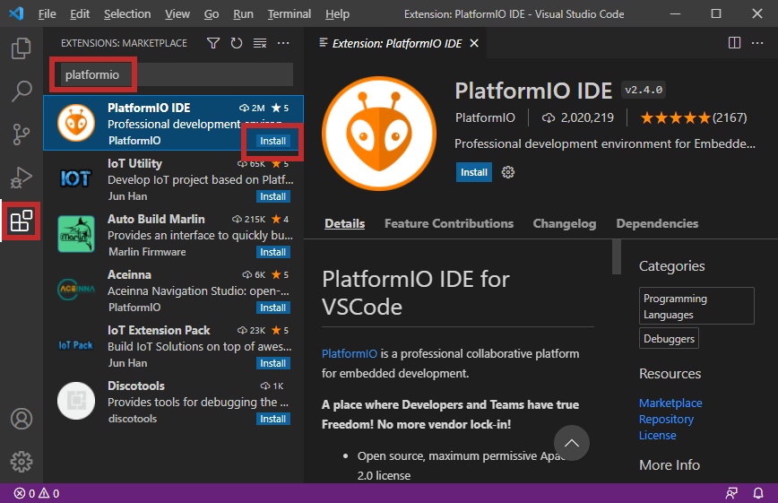
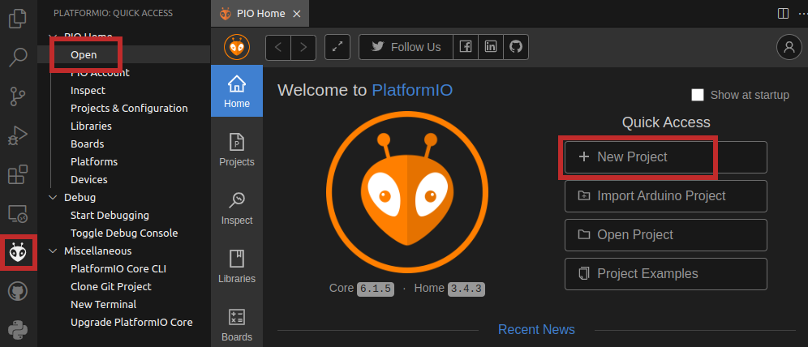
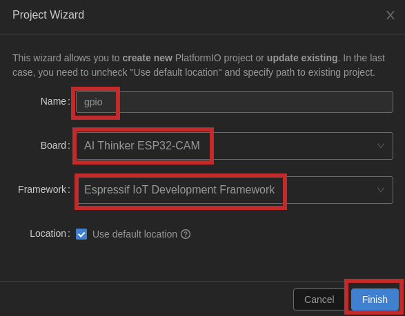
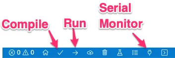

# ESP32 projects in C/C++

**Espressif IDF** and **PlatformIO** extensions are popular choices for developing ESP32 projects in C/C++ using Visual Studio Code. Each has its own strengths and weaknesses, so the best choice for you will depend on your specific needs and preferences.

[Espressif IDF](https://docs.espressif.com/projects/esp-idf/en/latest/esp32/get-started/) (IoT Development Framework) is the official development framework from Espressif Systems, the manufacturer of the ESP32 microcontroller. It is a very powerful and flexible framework, but it can also be quite complex to use, especially for beginners. The IDF provides a lot of low-level control over the ESP32, but it can be difficult to manage all of the configuration options and build processes. It provides a self-sufficient Software Development Kit (SDK) for any generic application development on these platforms, using programming languages such as C and C++.

[PlatformIO](https://platformio.org/) is a more user-friendly alternative to the IDF. It is a build system that can manage the compilation and flashing of ESP32 projects, as well as providing a variety of other features, such as integrated debugging support. PlatformIO supports a wide range of microcontrollers, including the ESP32, Arduino, STM32, AVR, and it has a large community of users. It can be used with VS Code to provide a powerful set of tools [to assist you in development](https://dronebotworkshop.com/platformio/).

| Feature | Espressif IDF | PlatformIO |
| :-- | :-- | :-- |
Official framework | Yes | No
Power and flexibility | High | Medium
User friendliness | Low | High
Ease of use | Low | High
Documentation | Good | Good
Community support | Medium | Large

## Installation of Espressif IDF with VS Code


1. Follow these instructions: [Installation on Linux and Windows](https://github.com/espressif/vscode-esp-idf-extension/blob/master/docs/tutorial/install.md) and install Espressif IDF extension.

2. It is recommended to start by an example project. See how to [create, build, and run your first project](https://github.com/espressif/vscode-esp-idf-extension/blob/master/docs/tutorial/basic_use.md).

  > **NOTE:** Please note that all available commands are accessible in VS Code in menu **View > Command Palette...** or by `Ctrl+Shift+P` shortcut, followed by a command `ESP-IDF: `
  >
  > Command | Description
  > :-- | :--
  > `F1` or `Ctrl+Shift+P` | Command Palette where all commands are found
  > `ESP-IDF: Show Examples Projects` | List of available projects
  > `ESP-IDF: New project` | Create a new project via Command Palette
  > `ESP-IDF: Set Espressif device target` | Select your Espressif target (esp32, esp32s2, etc.)
  > `ESP-IDF: Build your project` | Build the project
  > `ESP-IDF: Build, Flash, and start a monitor on your device` | Combine build, flash and serial monitor in a single command
  > |||
  > `ESP-IDF: Open ESP-IDF Terminal` | Open ESP-IDF Terminal where you can use `idf.py` command-line tool
  > `idf.py create-project NAME` | Create a new project titled `NAME` in ESP-IDF Terminal
  > `idf.py menuconfig` | Open project configuration
  > `idf.py build` | Build the project
  > `idf.py flash monitor` | Flashing esp-idf project and open serial monitor
  > `Ctrl+]` or `Ctrl+)` | Exit the monitor
  >
  > Other common [shortcuts in VS Code](https://code.visualstudio.com/shortcuts/keyboard-shortcuts-windows.pdf).

## Installation and usage of PlatformIO


1. Download and install [Visual Studio Code](https://code.visualstudio.com/) source code editor.

2. Run Visual Studio Code application:
   1. Open up the extensions viewer in menu **View > Extensions Ctrl+Shift+X**.
   2. Type `platformio` into the search bar.
   3. Press **Install** button on the result `PlatformIO IDE`. It may take a few minutes depending on your connection speed. Do not close any window and do not open other folders until the installing process is completed.

      

   4. After that, restart the Visual Studio Code application.

3. Create a new project:
   1. Click on the PlatformIO icon in the left-hand margin.
   2. In menu **PIO Home** select **Open**.
   3. Click to **New Project** button.
   
      
   
   4. In project wizard, type `gpio` as project name.
   5. Select ESP32 board you have.
   6. Change framework to `Espressif IoT Development Framework` and select location to your working folder.
   7. Click on the **Finish** button. The creation of first project may takes a few minutes and internet connection to download the needed libraries and frameworks is mandatory.

      

4. Code the application:
   1. Copy/paste the [basic template](https://raw.githubusercontent.com/tomas-fryza/esp-idf/main/examples-platformio/gpio/src/main.c) to your `GPIO > src > main.c` file.
   2. Add the following settings to `platformio.ini` project configuration file.

      ```bash
      monitor_speed = 115200

      # DTR & RTS settings of the serial monitor must be OFF
      monitor_rts = 0
      monitor_dtr = 0

      # Enable ANSI color codes in serial monitor
      monitor_raw = yes
      ```

   3. Connect your ESP32 board to USB port.

   4. Compile and upload the code. The handy shortcuts for building and uploading the code is available on the blue footer taskbar. Hover over the icon to get its functionality. First, compile (build) the project and then upload it to ESP32 board. Open the Serial monitor. (At some platforms you have to press on-board reset button.)

      

## Examples

1. For Espressif IDF
   1. [Hello world](examples-espressif/hello_world)
   2. [Remote control](https://gitlab.com/tbravenec/but_de2_esp32_exercises/-/tree/master/labs/01-http_led_control_ESP-IDF) of LED through HTTP server by [tbravenec](https://gitlab.com/tbravenec)
   3. [Introduction to FreeRTOS](https://gitlab.com/tbravenec/but_de2_esp32_exercises/-/tree/master/labs/02-rtos_blink_task_ESP-IDF) using LED blinking task by [tbravenec](https://gitlab.com/tbravenec)

2. For PlatformIO
   1. [Basic template with GPIO](examples-platformio/gpio)
   2. [Logging methods](examples-platformio/log_methods)
   3. [Tasks](examples-platformio/tasks)
   4. [I2C scan](examples-platformio/i2c_scan)
   5. [I2C DHT12 sensor](examples-platformio/i2c_sensor)
   6. [Wi-Fi APs scan](examples-platformio/wifi_scan)
   7. [Wi-Fi GET requests to HTTP](examples-platformio/wifi_get_requests)
   8. [Wi-Fi & DHT12 & ThingSpeak](examples-platformio/wifi_thingspeak)
   9. [Remote control](https://gitlab.com/tbravenec/but_de2_esp32_exercises/-/tree/master/labs/01-http_led_control_PlatformIO) of LED through HTTP server by [tbravenec](https://gitlab.com/tbravenec)
   10. [Introduction to FreeRTOS](https://gitlab.com/tbravenec/but_de2_esp32_exercises/-/tree/master/labs/02-rtos_blink_task_PlatformIO) using LED blinking task by [tbravenec](https://gitlab.com/tbravenec)

### Tested on

| **Version**                | **Result (yyyy-mm-dd)** | **Note**    |
| :------------------------- | :---------------------: | :---------- |
| Linux Mint 21.2 (Victoria) | OK (2024-01-06)         | Laptop      |
| Windows 10                 | OK (2022-11-18)         | HomeOffice  |
| Linux Mint 20.3 (Una)      | OK (2022-11-01)         | Laptop      |

```bash
# FYI: How to check OS version in Linux
cat /etc/os-release

# Or by Neofetch
neofetch
```

## Useful information

* [ESP32 brief overview](https://www.youtube.com/watch?v=DoctWoxIaH8) (YouTube video)
* [Git commands](docs/README-useful-git-commands.md)
* [ESP32-CAM board](docs/esp32-cam.md)
* [FireBeetle board](docs/firebeetle.md)
* [ ] ESP32 structure, versions

## References

1. Espressif Systems. [ESP-IDF Programming Guide](https://docs.espressif.com/projects/esp-idf/en/latest/esp32/)

2. Esp32 Tutorials. [Install ESP32 ESP-IDF on Windows and Integrate with VS code](https://esp32tutorials.com/install-esp32-esp-idf-windows-integrate-vs-code/)

3. [ESP32 for IoT: A Complete Guide](https://www.nabto.com/guide-to-iot-esp-32/)

4. Pedro Minatel. [ESP-IDF Development Tools Guide — Part I](https://blog.espressif.com/esp-idf-development-tools-guide-part-i-89af441585b)

5. Espressif Systems. [Build Your First Project](https://docs.espressif.com/projects/esp-idf/en/latest/esp32/get-started/index.html#build-your-first-project)

6. Random Nerd Tutorials. [ESP32-CAM AI-Thinker Pinout Guide: GPIOs Usage Explained](https://randomnerdtutorials.com/esp32-cam-ai-thinker-pinout/)

7. Renzo Mischianti. [ESP32-CAM: pinout, specs and Arduino IDE configuration – 1](https://www.mischianti.org/2021/08/30/esp32-cam-pinout-specs-and-arduino-ide-configuration-1/)

8. [How To Choose The Best RTOS for IoT Devices](https://www.nabto.com/how-to-choose-best-rtos-for-iot/)
