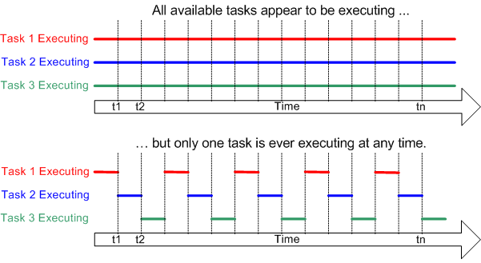
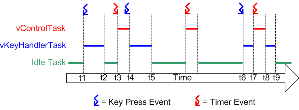

# Tasks

## Multitasking vs Concurrency

A conventional processor can only execute a single task at a time - but by rapidly switching between tasks a multitasking operating system can make it appear as if each task is executing concurrently. This is depicted by the diagram below which shows the execution pattern of three tasks with respect to time. The task names are color coded and written down the left hand. Time moves from left to right, with the colored lines showing which task is executing at any particular time. The upper diagram demonstrates the perceived concurrent execution pattern, and the lower the actual multitasking execution pattern.



## Real time scheduling

The diagram below demonstrates how two tasks (1: Suspend waiting for a key press, 2: Suspend waiting for 2ms since the start of the previous cycle) would be scheduled by a real time operating system. The RTOS has itself created a task - the idle task - which will execute only when there are no other tasks able to do so. The RTOS idle task is always in a state where it is able to execute.



## Creating tasks

Multitasking is performed on FreeRTOS by creating Tasks or Multiple Tasks. Tasks in FreeRTOS are individual programs which has capability to run independently and synchronously with other tasks. In General, each task is a program of its own with infinite while loop.

```c
#include <freertos/FreeRTOS.h>
#include <freertos/task.h>
```

## `xTaskCreate`

Create a new task and add it to the list of tasks that are ready to run.

```c
    xTaskCreate(
        vTaskBlink,  // Function to implement the task
        "Task 1",    // Friendly name of the task
        2048,        // Stack size in bytes, how much memory you want to keep it for this task 
        NULL,        // Task input parameter, NULL for no passing
        5,           // Priority of the task, 1 lowest, 5 highest
        NULL         // Used to pass back a handle
    );
```

## `xTaskCreatePinnedToCore`

Create a new task with a specified affinity and add it to the list of tasks that are ready to run.

```c
   xTaskCreatePinnedToCore(
       vTaskCore,   // Function to implement the task
       "coreTask",  // Friendly name of the task
       1000,        // Stack size in bytes, how much memory you want to keep it for this task
       NULL,        // Task input parameter, NULL for no passing
       2,           // Priority of the task, 1 lowest, 5 highest
       NULL,        // Used to pass back a handle
       coreID       // Core where the task should run
   );
```

## `vTaskDelete`

Remove a task from the RTOS real time kernel's management. The task being deleted will be removed from all ready, blocked, suspended and event lists.

## Naming conventions

* Variables of non stdint types are prefixed `x`. Examples include `BaseType_t` and `TickType_t`.
* API functions are prefixed with their return type, as per the convention defined for variables with the addition of the prefix `v` for void.
* API function names start with the name of the file in which they are defined. For example `vTaskDelete` is defined in `tasks.c`, and has a void return type.

## References

1. FreeRTOS. [Multitasking Basics](https://www.freertos.org/implementation/a00004.html)

2. https://esp32tutorials.com/esp32-esp-idf-freertos-tutorial-create-tasks/

3. Espressif Systems. [Task API](https://docs.espressif.com/projects/esp-idf/en/latest/esp32/api-reference/system/freertos.html#task-api)

4. https://www.youtube.com/watch?v=k_D_Qu0cgu8

5. https://www.youtube.com/watch?v=ytRRG96cMF0

6. https://github.com/coder137/ESP32-Repo/tree/master/FreeRTOS/Task

7. [Style Guide](https://www.freertos.org/FreeRTOS-Coding-Standard-and-Style-Guide.html)
